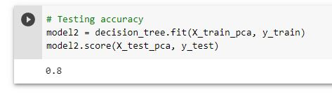

<h1 align="center"> Principal Component Analysis using Python </h1>

    

Principal Component Analysis, or PCA, is a dimensionality-reduction method that is often used to reduce the dimensionality of large data sets, by transforming a large set of variables into a smaller one that still contains most of the information in the large set.

## The stages in this exercise are as follows:

1. Split the data set.
2. Train the model without PCA.
3. Train the model with PCA.
4. Evaluate the results of the two models.

## Model performance without PCA

We will use the Decision Tree model and calculate how accurate it is without using PCA.

    

Accuracy without PCA is 0.9 or 90%.

## Model Performance with PCA

We will use PCA and calculate the variance of each attribute. The results of the variance of each attribute are as follows.

    

The result is 1 attribute has a variance of 0.931, which means that the attribute stores high information and is much more significant than other attributes.
Looking at the previous variances, we can take the best 2 principal components because the total variance when added up is 0.977 which is quite high.

The results of the accuracy test after using PCA are as follows.

    

In the experiment above, we can see that with only 2 main components or 2 attributes, the model still has a fairly high accuracy, which is 80%. With principal components, you can reduce less significant attributes in predictions and speed up machine learning model training time.
